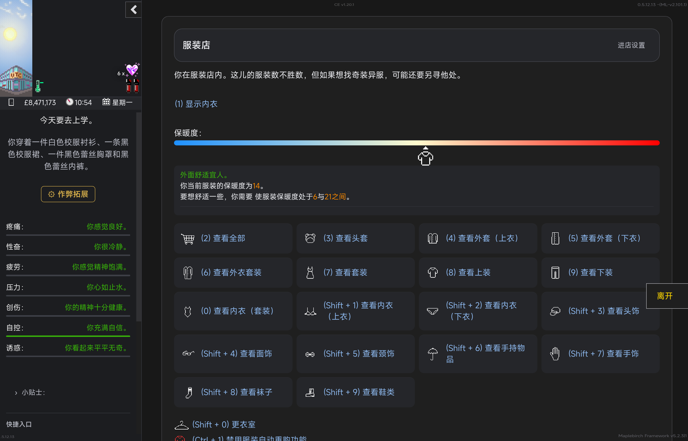
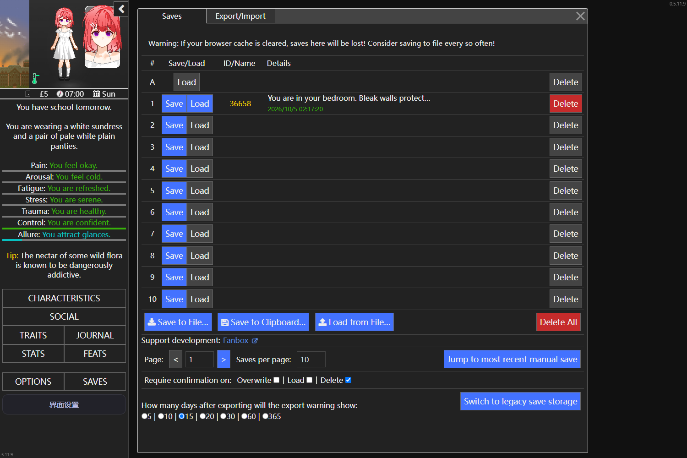
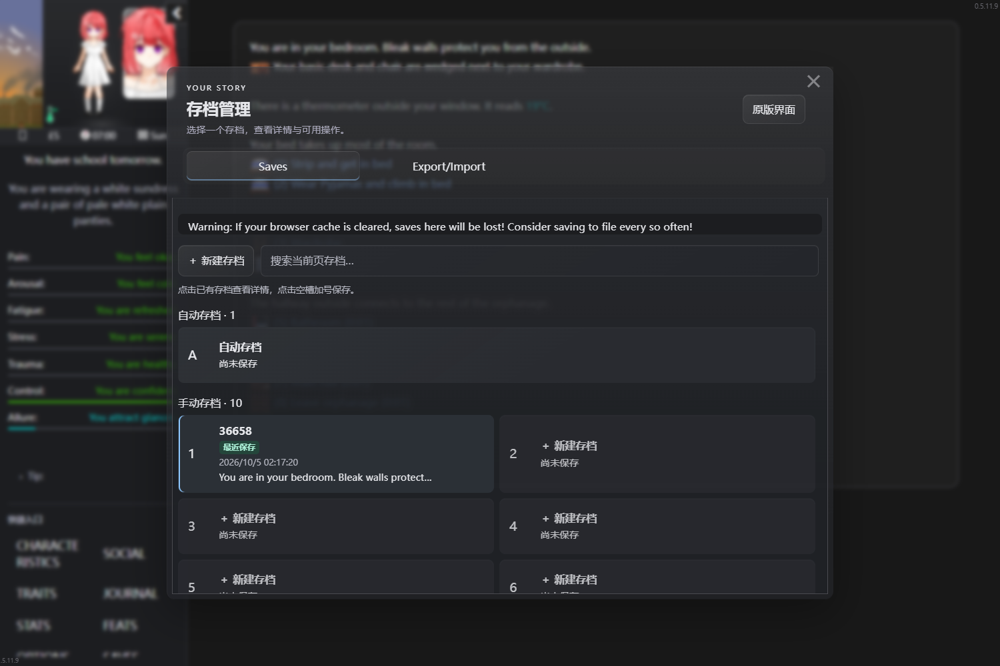

# DoL Soft & Wet Game UI

**2.2.2 — Crazy Diamond** · 支持 **DoL 0.5.11.9 / 0.5.12.13**

**Soft & Wet UI** 为 Degrees of Lewdity 提供统一的现代深色界面，重新组织衣柜、服装店、战斗及常用菜单。手机使用紧凑布局与详情抽屉，平板和桌面利用宽屏展示列表与详情；外层柔雾 Acrylic、内层轻卡片，让信息与操作保持清楚。

**[下载 UI 主包](https://github.com/102326/DoL-Game-UI/releases/download/v2.2.2/DoL-SoftWet-GameUI-2.2.2.mod.zip) · [发布与可选兼容包](https://github.com/102326/DoL-Game-UI/releases/tag/v2.2.2) · [安装步骤](#安装与升级) · [反馈问题](https://github.com/102326/DoL-Game-UI/issues)**

普通玩家只需主包；使用对应第三方 Mod 时再选装兼容包。需要 ModLoader **2.100.0+**、TweeReplacer **1.0.0+**。导入 ZIP，**不要解压**，然后重启游戏。模组不包含游戏本体、图片素材或 APK。

## 核心界面

### 衣柜

- 查看完整穿搭、已穿戴标记、服装信息、状态与保暖情况。
- 按分类搜索和排序，点选衣物换装。
- 在整理模式中审查多选丢弃、剪开套装，以及满足条件时的修理和衣柜转移。

### 服装店

- 宽屏展示商品列表与详情，手机使用详情抽屉。
- 分类、搜索、配色与购买操作区集中组织，可保存进店默认服装类型。
- 沿用原游戏价格、购买和试穿规则。

**服装店分类入口 · Soft & Wet UI 2.2.2 · Android 平板**

这是已安装版本的真实截图，包含 ReOverfits 4.1.1 与兼容包 0.2.2 的三个外层分类。展示的是分类入口，不是商品列表。界面会随视口、背景、显示偏好和 Mod 组合变化。

### 战斗

- 按部位组织行动区域，显示当前选择摘要与状态反馈。
- 区分普通行动、选中状态和底部操作，方便检查后继续。
- 保留原游戏动作、判定和结算。

当前版本的衣柜、商品列表和战斗截图后续补充。

## 其它界面与功能

| 界面 | 主要内容 |
| --- | --- |
| 存档管理 | 宽屏双列、手机单列，最近保存标记与详情抽屉；可选“存档 V2”列表/详情布局，保留原版操作与回退 |
| 社交与角色面板 | 轻卡片与分组，组织关系、属性、特质和状态信息 |
| 日志、统计与成就 | 内容分组与导航，稳定的正文阅读区域 |
| 游戏设置、态度与作弊 | 原生控件美化、轻分组与响应式布局，沿用原控件和生效规则 |
| 界面设置 | 字体、阅读宽度、间距、视觉档位、减少动态效果与独立页面开关 |

查看存档界面原版对比（Soft & Wet 2.0.2）

以下为同一隔离新游戏、同一桌面视口下的真实截图，不使用用户存档。它们展示 **2.0.2**，不是 2.2.2。

| 原版存档 | Soft & Wet 2.0.2 存档 |
| --- | --- |
|  |  |

存档详情与社交对比见 [2.0.2 更新报告](docs/RELEASE_2.0.2_PUBLIC.md)。

游戏规则、购买价格、穿戴限制与存档格式仍由原游戏处理。衣柜整理确认后逐件执行；中途出错会停止并报告进度，已完成的操作不自动撤销。

## 安装与升级

1. 准备 DoL **0.5.11.9 或 0.5.12.13**，以及 ModLoader **2.100.0+**、TweeReplacer **1.0.0+**。升级前建议备份存档。
2. 下载并导入 UI 主包 ZIP，**不要解压**。升级时替换已有同名包，不要同时启用多个版本。
3. 建议在内容 Mod 之后加载 UI；需要兼容包时，在 UI 和目标 Mod 之后加载对应兼容包。特殊 Lyra 包的顺序见 [兼容包说明](docs/OPTIONAL_ADAPTERS.md)。
4. 重启游戏，在侧栏 **界面设置** 调整显示与页面功能。

加载器中原有的 `DoLGameUI` 是本 Mod 的内部标识，升级时继续替换它。曾安装 **DoLShopPageExperiment、DoLMidnightTheme 或 DoLCombatUI** 独立包的用户，应先禁用旧包，避免重复修改同一界面。详细迁移说明见 [旧独立包迁移](docs/OPTIONAL_ADAPTERS.md#旧独立包迁移)。

## 设置、兼容与回退

- 各专用界面可独立关闭，回到对应原版页面；全局关闭 **启用 Soft & Wet 2.0 界面** 或使用 **回退原版界面**，直接使用原版 UI。
- 衣柜操作执行期间需等待结束后再回退。显示偏好保存在当前浏览器或应用中，与游戏存档分离。
- 若界面设置也无法打开，在加载器中禁用本 Mod 并重启。
- **1.x（1.1.0）是独立 LTS**，不作为 2.x 总关闭后的第二套主题。

支持的游戏版本为 **0.5.11.9 / 0.5.12.13**，不保证所有整合包和 Mod 组合。完全替换商店、动作、角色图层或页面结构的 Mod 可能需要专门适配；遇到异常可先关闭对应专用界面。

ModHub、MapleBirch、原版优化、ReOverfits 及指定 Lyra 的适配由 [独立兼容包](docs/OPTIONAL_ADAPTERS.md) 提供，按需安装。最低版本放宽不代表全部后续版本已经验证；不满足结构、接口或数据条件时，适配可能减少或退出。

### 性能选项

衣柜分页在新安装时默认开启，每页显示 40 件；搜索、排序与全选仍作用于当前分类的完整数据。已有用户的偏好保持原值。

衣柜隐藏列表、启动缓存、商店离屏绘制和商店按页生成等**进阶实验，新安装时默认关闭**，可分别控制，商店按页生成不需要额外 ZIP。减少 DOM 工作量不等于已证明换装、购买或启动整体变快。

生效时机、作用范围与关闭方式见 [性能选项与实验](docs/UI_SETTINGS.md#性能选项与实验)。

## Mod 作者与开发者

技术栈：**Vue 3 / TypeScript / Vite / Tailwind CSS**。UI Runtime 与 Adapter 接入是可选能力，不要求第三方 Mod 依赖 Soft & Wet。

- [UI Runtime API](docs/UI_RUNTIME.md) 与 [接入示例](examples/ui-surfaces/README.md)
- [基础设施与兼容边界](docs/UI_INFRASTRUCTURE.md)、[独立 Adapter](docs/OPTIONAL_ADAPTERS.md)
- [开发、构建与测试](docs/DEVELOPMENT.md)、[2.2 TypeScript 整理](docs/TYPESCRIPT_2.2.md)、[更新记录](CHANGELOG.md)

构建需要 Node.js **22.12+**、npm、Python **3.10+**；运行 `npm ci` 和 `npm run package`，输出为 `dist/DoL-SoftWet-GameUI-<版本>.mod.zip`。普通构建无需游戏本体，游戏集成测试资源需自行准备。可通过 `DOL_RELEASE_DIR` 指定额外输出目录。

**界面设置 → 开发检查** 中的 Runtime Inspector 可查看页面、Adapter 和降级原因。排查第三方接入时，以实际原节点、事件与原版状态为准。

## 反馈

请提供游戏与 UI 版本、设备和视口、相关 Mod 版本、复现步骤及错误信息。截图请遮挡不希望公开的内容；通常不需要上传完整存档。[提交问题](https://github.com/102326/DoL-Game-UI/issues)。

## 许可与来源

项目原创代码使用 [MIT](LICENSE)。衣柜隔离绘图代码派生自 Degrees of Lewdity，适用 **CC BY-NC-SA 4.0**，见 [来源与修改说明](UPSTREAM-RENDERER-NOTICE.md) 和 [完整许可](UPSTREAM-RENDERER-LICENSE)。包含该代码的发行包不是整体仅适用 MIT；第三方依赖声明随安装包附带。
