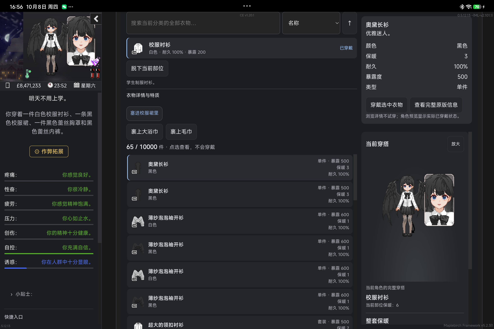
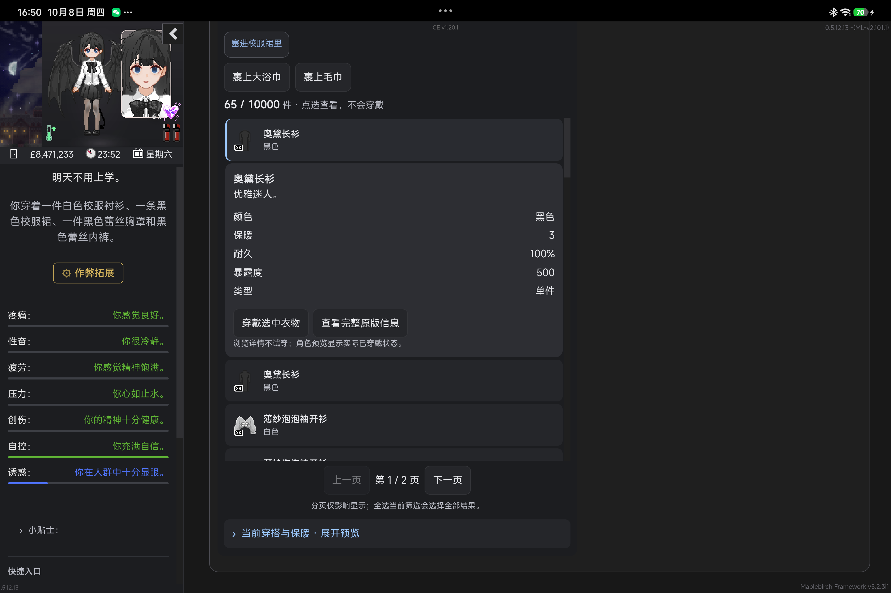

# Soft & Wet 3.0 — M2 衣柜候选交付

日期：2026-10-08。结论：**本轮 M2 已完成，达到完整衣柜候选标准；第三方实际业务覆盖有限。**

正式基线仍为 2.2.2 — Crazy Diamond，正式仓库、Release 与 tag 未修改。M2 从 M1 提交 `46944af` 演进，位于 `prototype/soft-wet-3-m2`。候选保留既有版本字段 2.2.2，供实验兼容检查，不表示正式包已经更新。平板使用临时候选加载，检查后已恢复正式 2.2.2。

## A. 代码交付

| 文件 | M1 → M2 变化 |
| --- | --- |
| `src/wardrobe/source.ts` | 私有来源层批量解析操作 key；一次核对当前页面、投影指纹和原对象身份，解析后再次核对页面归属；移除向会话暴露原 Entry 集合及硬编码的实验类别说明。 |
| `src/wardrobe/main.ts` | 穿戴、整理审阅和确认共用来源绑定检查；执行期间阻止重入；确认与批次间检查原库存、定义、场景和穿戴状态；异常结果停止，不自动重放。 |
| `src/wardrobe/ClothingDetails.vue` | 共用只读详情组件，接收显示投影及操作 key，不接收原游戏对象。 |
| `src/wardrobe/WardrobePanel.vue` | 默认一键穿戴；可选详情浏览；宽容器侧置详情，窄容器在所选行之后显示详情；整理时收起预览，操作反馈放在列表附近。 |
| `src/wardrobe/style.css` | 复用现有 token、分页和容器布局；窄屏整理操作栏进入内容流，减少遮挡；复杂分类可换行。 |
| `tests/wardrobe-m2.cjs`、`tests/wardrobe-source-m2.test.cjs` | 从 M1 测试演进，覆盖投影、失效绑定、宽窄详情、未知入口、真实定义夹具和卸载恢复。 |
| `tests/wardrobe-features.test.cjs` | 增加审阅后定义变化阻止派发、正常批量修理及原状态结果验证。 |

保留原穿戴、脱下、毛巾、修理、转移、拆分套装、删除的游戏宏，以及原套装管理、随机配置和特殊控件。没有把这些业务搬进 Runtime Core，没有新增库存真值或通用事务系统。

替换 M1 的窄屏详情前置及自动滚动方案，不再选一件就滚动整个页面；移除虚构的扩展分类 metadata。M1 基线保存在 Git，当前只有一套候选衣柜实现。

公共 `window.DoLGameUI.ui` API v1、槽位映射接口、主题/档位、Adapter、Surface、Inspector 和已有显示偏好未改。详情浏览默认为关闭，仅限当前会话；未新增持久化设置。未修改存档模块或 `save.metadata.dolGameUI.gameTime`。

## B. 玩家体验对照

相对正式 2.2.2，默认点衣物直接穿戴的效率保留。需要阅读描述时可开启“先查看详情”，此时选中只展示信息，明确点击穿戴才执行原操作；角色预览始终是实际穿搭。

宽容器中列表、选中详情与实际穿搭并列组织；窄容器中详情紧跟所选行，预览可折叠。布局依据衣柜实际宽度，而非仅依据设备屏幕。平板 WebView 中将容器限制为 550px 后，详情进入列表，无横向溢出。

整理时隐藏预览、集中显示选择与确认信息；修理等原操作反馈位于列表附近。未知控件有实际可点击的“原版及扩展信息”入口，未知内容不会因投影未识别而消失。关联套装部件依据原库存与投影数量给出说明，空分类和搜索无结果分别提示。

### 平板真实 WebView：宽容器

### 同一平板：550px 衣柜容器

这张用于证明容器自适应，不冒充物理手机验收。

## C. 验证与限制

### Delivered

完整衣柜候选、原操作边界保护、详情组件、自适应整理/浏览布局、测试及本报告。没有新增依赖、SDK、状态管理框架、虚拟列表或额外缓存。

### Validated

- 构建通过：字段一致性检查、Vue/TypeScript 检查、Vite 与 early script；`git diff --check` 通过。
- 来源单测：批量 all-or-none、重复 key、原对象身份替换、定义/显示内容变化、页面在原 helper 调用期间失效、销毁后旧绑定不可用。
- 原版 DoL 0.5.11.9 / Edge 隔离环境：快速与明确穿戴、脱下、毛巾、删除及索引变化、批量修理、转移与容量保护、关联套装修理/拆分、原套装控件、未知内容、异常回退、挂载清理。原 `V.worn`、库存及时间用于验证结果，不只看按钮状态。
- 原版修理测试发现第一件修理后时间推进会合法改变穿戴状态。已改为每次原宏成功返回后更新批次预期，再保护下一次派发；两件修理及原时间成本验证通过。失败记录保留，没有反复重跑掩盖失败。
- 平板 `0509B830099C3540` / M367FC / Android 17；测试包 `com.vrelnir.dol.lyra.uicompat051213` / DoL 0.5.12.13 / WebView 154.0.8037.58：真实衣柜 65 件上装，宽布局、550px 容器布局、只读选中、未知原控件点击、三轮开关回退及节点恢复。
- 真机销毁后 `wardrobeList`、`wardrobeExits`、`listoutfits`、`warmth-description` 的节点身份、父节点、前后兄弟和原 handler 均恢复。恢复正式 UI 后库存、穿戴与显示偏好一致，实验元素/全局变量已清理。
- 实际工具使用：现有 Paisley Park 3.0.2 的 doctor、game-observe、capture、三个审阅后的 Journey；精确节点身份、临时加载、原状态读取及计时采用既有 CDP transport。未动共享 Gameplay Ledger，未执行 Android 游戏业务或存档写入。

#### ReOverfits 证据边界

1. **实际加载**：平板 ReOverfits 4.1.1 已加载，三种外层槽位定义存在；当前各衣柜外层库存均为空。
2. **非空替代验证**：读取实际平板定义，在隔离 0.5.11.9 环境建立受控非空夹具。详情显示真实定义的中文名称/描述；原游戏宏完成 `froggy` 三件套穿戴，三个 `V.worn` 槽位更新、原库存条目移除。
3. **不等同完整验收**：隔离环境未加载整套 ReOverfits，真机未制造库存或执行穿戴，因此不宣称 M2 已完成 0.5.12.13 非空 ReOverfits 真机业务验收。

#### 有限性能检查

| 场景 | M1 p50 / p95 | M2 p50 / p95 |
| --- | --- | --- |
| 本地来源读取，1000 条库存/500 条定义，25 次 | 4.53 / 5.40 ms | 4.54 / 5.02 ms |
| 平板 `ui.refresh`，65 件上装，12 次 | 9.6 / 22.9 ms | 10.7 / 19.5 ms |

未见本轮场景下的明显刷新退化，不据此声称 FPS 或整体性能提升。平板比较限定为 JavaScript 刷新阶段，并非整帧或完整视觉对比。没有证据支持增加缓存、虚拟列表或 Perfetto 调查。

### Not validated

物理手机、其它 WebView、全部服装/游戏版本/Mod 组合；非空 ReOverfits 在本候选的真机穿戴及完整第三方业务。这些为后续 coverage，不是本轮未实现功能。

### Known limitations

- 详情浏览仍是会话选项，正式设置取舍留待使用反馈。
- 未识别描述/特殊控件通过原版入口访问，不承诺所有未知字段都转换成新组件。
- 保留既有原节点岛和少量原控件移动；卸载恢复已验证，不宣称消除了所有第三方脆弱 selector 风险。
- 不处理已存在的历史 Gameplay pending effect，也不绕过工具保护做真机业务验证。
- 初次窄布局采样早于 ResizeObserver 稳定，随后等待并复核正确；首次恢复脚本因候选已销毁而访问不存在的全局对象失败，修正可选销毁后恢复成功。这是采样/脚本问题，记录保留。

### 可复核本地证据

原始 JSON、Journey manifest 和截图位于 `tests/artifacts/m2-20261008/`（Git 忽略，本机保留）：`browser/results.json`、`final-lifecycle.json`、`narrow-check.json`、`final-wide.json`、`live-perf-m1.json`、`live-perf-m2.json`、`restore-after-destroy.json`、`cleanup.json`。其它衣柜专项结果位于 `tests/artifacts/wardrobe-*-verification.json`。

最终验证 bundle SHA256：JS `d0c7d9198bcc0a7ae21573e9d8b5c18dd841ddeb7b82e748e0106aa7708091d2`；CSS `098c68217e3a04cab5c52b18eb931381880ce0e7f345e3a7488ab4fec36dacbd`。

## D. 下一阶段建议

1. **M2 达到完整候选标准**：主要路径、来源边界、自适应、未知入口、回退与代表性性能均有证据；覆盖有限明确列出。
2. **适合进入 3.0 主线**：私有来源/显示投影、操作 key 与派发前验证、默认快速穿戴、可选详情、宽窄组织、原控件入口和生命周期护栏。待 3.0 整体合入时进入，不修改现有正式版。
3. **放弃或可选**：放弃硬编码第三方 metadata、窄屏前置详情自动滚动；浏览模式暂保留可选。不新增通用衣物 SDK。
4. **局部收口**：本轮无阻塞项。真实非空扩展库存、物理手机使用反馈可继续补覆盖，但不无限等待或构造真实存档。
5. **适合进入 M3**：可以，需用户确认后启动服装店阶段；复用既有原购买链，不能把衣柜来源机械推广为通用商品模型。本轮未启动。
6. **工作量估计**：M3 可拆为来源/原购买绑定、布局/详情、代表性现场收口三段，约 2–3 轮集中开发；若目标同时改变购买交互或发现第三方结构冲突，需要重新估算。完整 3.0 发布日期取决于后续页面范围，不从 M2 外推承诺。
