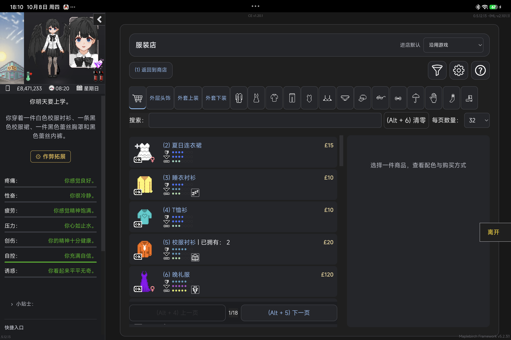
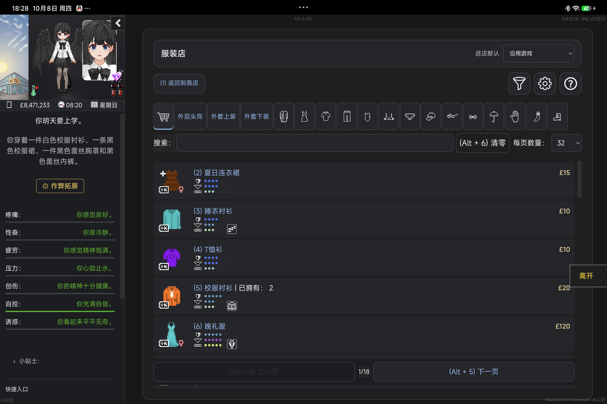
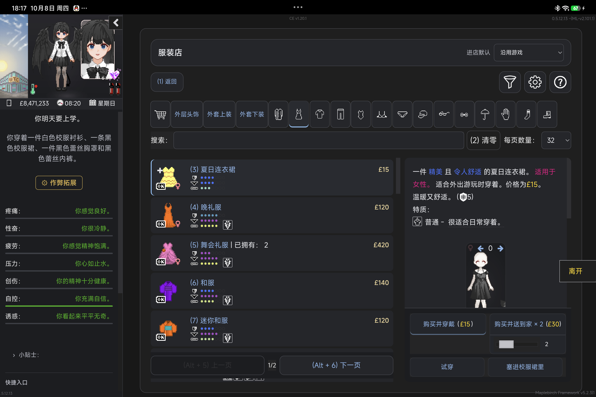
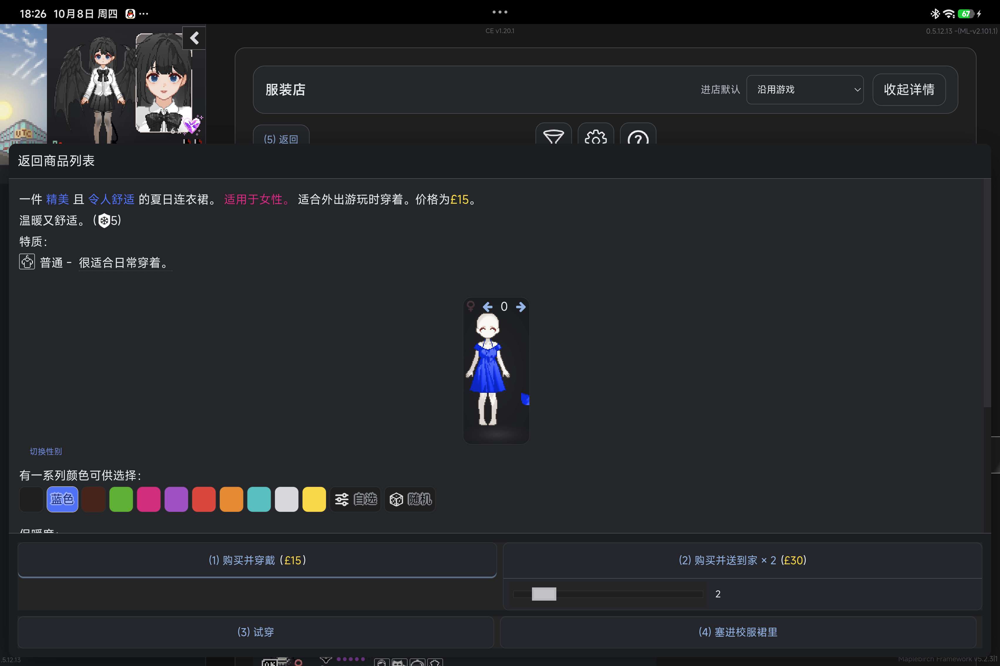

# Soft & Wet 3.0 — M3 服装店候选

日期：2026-10-08。分支：`prototype/soft-wet-3-m3`，基于 M2 `a52e08e`。本报告与源码在同一候选提交中。正式 2.2.2、Release、tag、生产仓库保持独立；未启动 M4。

## A. 代码与所有权

- `src/shop/source.ts`：商店领域局部来源。原 DOM、报价、颜色/数量、原变量对象与衣物定义仍是真相源。内部保留原节点绑定，输出显示投影；不建立库存模型或新的购买 Runtime。
- `src/shop/main.ts`：根据来源安排原节点；原选择、颜色、购买和试穿 handler 执行业务。派发前核对当前 Passage、节点存活、原变量/定义身份与报价指纹；已派发控件不重复执行。报价失效时提示重新选择，不自动重试。仅给原购买/试穿链接加 capture 护栏，未知操作继续交给原版。
- `src/shop/Toolbar.vue`、`style.css`：未选商品时列表占用可用空间；有详情时宽容器双栏，实际容器小于 800px 时单列列表与可关闭 Drawer。判断依据原商店容器宽度，不是设备标签。工具栏入口按该状态呈现。
- 保留原 `#clothes-list`、分类、搜索、分页、颜色和购买控件，保留已有局部 reversible move、原版回退、渐进分页、deferred paint 与 MutationObserver fast path。Vue 只拥有工具栏，业务控件仍为原节点。
- 新增一个商店局部 ResizeObserver；布局变更安排在 RAF，卸载取消 RAF 并断开 Observer。没有新增全局扫描器、依赖、状态同步框架或公共 API。
- 未知详情正文、原控件和仅含操作的 footer 也能显示，不因缺少标准颜色块而隐藏。重名克隆不作为选中商品的业务身份；原版重建列表时仅做唯一显示指纹的高亮重关联。
- **执行产品决策**：删除衣柜浏览模式入口、状态、`onSelect`、独立 `ClothingDetails.vue`、相关样式与测试。保留默认单击穿戴、原按需衣物信息入口、角色预览、整理、来源投影、有效期校验和回退。窄容器必要衣物指标改为紧凑换行显示，不隐藏后再依赖被删除的详情实验。
- `tests/shop-source.test.cjs`：原报价变化、定义变化、页面过期、一次派发、不可刷新重新授权、未知控件/仅含 footer。
- `tests/shop.test.cjs`：550px 容器与详情开关，重名克隆隔离，沿用原购买/颜色/试穿/存读档隔离测试；衣柜操作 key 从当前投影获取。
- `tests/wardrobe-m2.cjs`：移除实验用例，保留快速穿戴、来源失败、扩展定义、宽窄布局、原节点恢复和预览 Observer 生命周期测试。M2 历史分支与报告不修改，本轮决定覆盖其“保留浏览模式”建议。

没有改变 API v1、ModLoader 契约、存档格式、主题偏好或第三方 Adapter 的业务所有权。构建和 typecheck 通过。最终 bundle：JS `4e339901089b3a07222b3285abe77cd0bb69e2cedc1da295bd68b3a71777d706`；CSS `e0a9c18dfc63d2dd2009a53bea6a626d88f0ab1a70ebadaac5f66ae03e136f0f`。

## B. 玩家体验对照

| 场景 | 正式 2.2.2 | M3 候选 |
|---|---|---|
| 未选商品浏览 | 空详情区仍占右侧 | 列表使用可用宽度 |
| 宽容器选中商品 | 原列表与原详情双栏 | 保留双栏与原操作，增加报价有效期保护 |
| 宽 viewport 中的 550px 商店 | 仍可能按 viewport 排挤压双栏 | 按商店实际宽度单列，详情用 Drawer |
| 颜色/数量/购买 | 原控件执行业务 | 保留原控件，拒绝过期和重复派发 |
| 第三方分类/未知内容 | 原节点与回退 | 继续保留，不要求先认识全部内容 |
| 衣柜快速换装 | 默认一次点击 | 仍一次点击，删除先浏览再穿戴实验 |

### 实际平板截图

正式版未选商品：

候选未选商品：

候选宽容器详情：

真实 WebView 内将商店容器控制为 550 CSSpx 后的 Drawer：

以上为同一 Android 测试 App 的已审阅截图。550px 是受控容器测试，**不是手机或物理竖屏证据**。打开动画中间帧可能短暂透出背景，报告选择稳定后截图。

## C. 验证与限制

### Delivered

M3-A 来源与派发边界、M3-B 容器/内容/选择状态自适应、M3-C 未知内容与恢复候选，以及衣柜实验删除。未修改正式发布版本，未把自适应决策提升为通用业务框架。

### Validated

- `npm run build`：字段检查、Vue/TS/Adapter/early 类型检查与构建通过。
- `node tests/shop-source.test.cjs`：局部来源/过期报价/一次派发/未知 footer 通过。
- `node tests/shop.test.cjs`：隔离原版 DoL 0.5.11.9 / Edge，原购买、颜色与变体、数量、余额不足、试穿返回、搜索/分页、550px 和 390px 布局、未知节点、生命周期通过。原购买 → 衣柜穿戴 → IDB/序列化保存 → 无 UI 加载/导入 → UI 重开通过；这里使用隔离浏览器数据，不是用户存档。
- `node tests/wardrobe-m2.cjs`：移除浏览实验后的原一击穿戴、550px、原版入口、扩展定义夹具、源失败、六次挂载/预览 Observer、原父子/兄弟/handler 恢复通过。
- `node tests/wardrobe-features.test.cjs`：本轮前段通过修理、转移、容量、套装与原重置专项；随后未修改这些逻辑，复用结果。
- Paisley Park Skill / CLI **3.0.2**；明确选择平板 M367FC / Android 17 / 独立 `com.vrelnir.dol.lyra.uicompat051213` / DoL 0.5.12.13 / UI 标识 2.2.2(API 1)。M2 已验证的 WebView 154.0.8037.58 为环境历史记录，本轮不重复读取 Provider 版本。
- 实际 Android：商品选择、宽容器详情、550px 单列、详情关闭/重新打开与 focus、原 `V.colouraction='blue'`、原蓝色色块 active。购买区域控件中心 hit test 正常，未购买/试穿。
- ReOverfits 4.1.1 的外套上装入口触发原 `clothingShopSlot='over_upper'`，此现场分类为空，没有伪造非空扩展库存。临时未知按钮保留、可见且原 handler 收到一次点击；只改变测试计数。
- 三次 UI 关闭/启用后原控件仍在，始终一个 host/close。额外无业务重建的候选装卸检查确认 `#clothes-list`、详情、分类、optionsBar、分页的原节点、父节点、前后兄弟和 handler 完全恢复。
- 恢复正式 2.2.2，临时候选 CSS/JS/未知按钮/受控宽度均移除，原钱、衣柜库存、已穿戴与 UI 偏好未改变；自身 CDP transport 已关闭。商品浏览/颜色值是原 UI 操作结果，没有写回业务状态来伪造恢复。
- 有限成本采样：同场景 32 商品、1501 个商店后代节点；12 次显式 refresh，M3 均值约 1.47ms，正式版约 0.37ms。来源与 guard 增加约 1.1ms，DOM 数量未增长。属于有限同步调用观察，**不等于 FPS、长时间内存或整帧性能证明**。渐进页/快捷编号的 fast path 保留，隔离用例确认不增加 full scans。

### 实际失败与修复

1. 新 ResizeObserver 同步修改布局触发真机 `ResizeObserver loop completed with undelivered notifications` 原生错误弹窗，CDP 等待超时。保留 `narrow.json` 和 `narrow-capture`；用已审阅坐标通过 ADB 关闭该错误弹窗（CDP 已阻塞），改为 RAF 更新并取消卸载排队。随后同一实际 550px 场景复验通过。归属候选 UI 实现，不能写成工具缺陷。
2. 候选暂载于正式版样式之上时，旧 CSS 隐藏详情入口，Journey 首步失败；真实 computed style/零 hitbox 确认。增加 host 内明确 display 后，同一 Journey 打开、颜色、关闭、重新打开通过。
3. 返回全部商品 Journey 的分类点击 completed，`.clothing-item` visible 等待 failed，报告为 partial。后续原 DOM 证实 32 商品、可见 page-0 与实际截图。该 wait 原因 **unknown**，没有为刷绿重复点击，也不把 partial 改写 complete。
4. 原合同初始快照在原版商品/分类重建后不再 connected，初次 restore 记录保留；这不能证明 UI 卸载恢复失败或成功。补做没有业务重建的原节点快照→候选→卸载检查，全契约恢复。
5. 一次 scoped probe 使用不存在的 `DoLGameUI.shop` 导致 TypeError；改用现有 `DoLShopUI`/原状态。工具没有注入该错误。早期 CLI 文件名/参数错误及隔离用例旧 key/旧高亮断言已修正，失败不抹除。

### Not validated

真实 0.5.12.13 购买/试穿、物理手机/旋转、非空 ReOverfits 商店商品、其它第三方组合、长期内存与 FPS。共享 Gameplay 未结清记录保持不动，本轮没有换 Store、清 Ledger 或绕过 pending effect 购买。这些是覆盖边界，不是新增阻塞任务。

### Known limitations

- 商店原节点仍有既有可恢复移动，结构敏感旧 Mod 仍可能需要专用样式/Adapter；没有宣称所有 Mod 兼容。
- 未知商品/操作保持 native，不从名称猜测其业务身份。未知报价结构不会得到本轮已知购买护栏的完整语义覆盖。
- 原报价/状态发生变化但第三方保留同一操作控件时会拒绝该绑定，需重新选择/原版重建；不为了方便重新授权可能已派发的控件。
- 新局部来源每次 full refresh 读取当前商品与报价，当前代表性开销有限，但不是零成本；没有引入长期缓存或全局镜像。
- 本轮最后的未知 footer 补充及提示清除为局部单测/typecheck/build 验证，复用其余通过的设备/集成证据，没有为两行改动再次跑发布级流程。

原始本地证据：`tests/artifacts/m3-20261008/`（Git 忽略，本机保留）；重点为 `doctor.json`、`inject.json`、`select-run`、`narrow-fixed.json`、`narrow-run-fixed`、`after-colour-fixed.json`、`extension-proof.json`、`lifecycle.json`、`perf-m3.json`、`perf-formal.json`、`restore.json`、`restore-contract-cycle.json`、`wardrobe/results.json`。受控截图纳入本候选报告；其余原始状态只保留本机。

## D. 下一阶段判断

1. **M3 达到完整候选标准，覆盖有限**：约定的来源、操作护栏、自适应和代表性回退成立，已发现两项 UI 阻塞已修复。
2. **解决窄容器挤压**：真实 WebView 550px / viewport1363px 为单列且无横向溢出；不是只改 viewport 断点。
3. **有实际自适应收益**：未选商品不保留空详情、宽/窄采用不同详情组织、原操作始终可达；颜色选择保留原规则。
4. **减少耦合**：业务/报价解释和临时绑定落到商店局部 source，工具栏只接收显示/UI 状态，不持有库存或修改购买逻辑。
5. **第三方/未知可访问**：代表性扩展入口、临时未知 handler 和 footer 夹具通过；非空扩展商品另列覆盖。
6. **值得正式保留**：容器决策、按内容展开详情、原控件 + freshness/一次派发护栏、可恢复原节点、未知 native fallback、既有分页 fast path。
7. **放弃实验**：衣柜先浏览再穿戴及独立详情系统已删；不增加通用商品 SDK、第二购买状态源或长期 DOM 镜像。
8. **M2 保持正常**：快速穿戴、预览、整理/操作校验、来源与回退专项通过，历史 M2 分支保留。
9. **适合进入 M4 规划**：可以。战斗与存档须分别保留原事件、事务和状态所有权，不能机械复制商店 guard。未自动启动。
10. **工作量修正**：M3 本轮已收口。M4 建议按战斗和存档分别定义 Done；预计各需约 1–2 轮集中实施/专项验收，若涉及存档事务或第三方结构，重新估算。不是 3.0 发布时间承诺。
