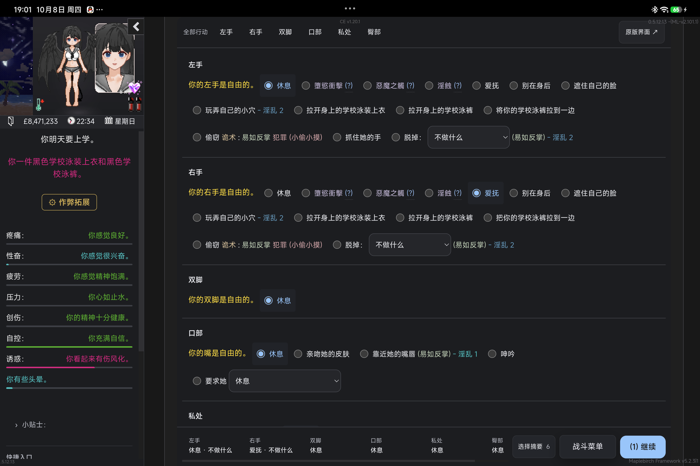
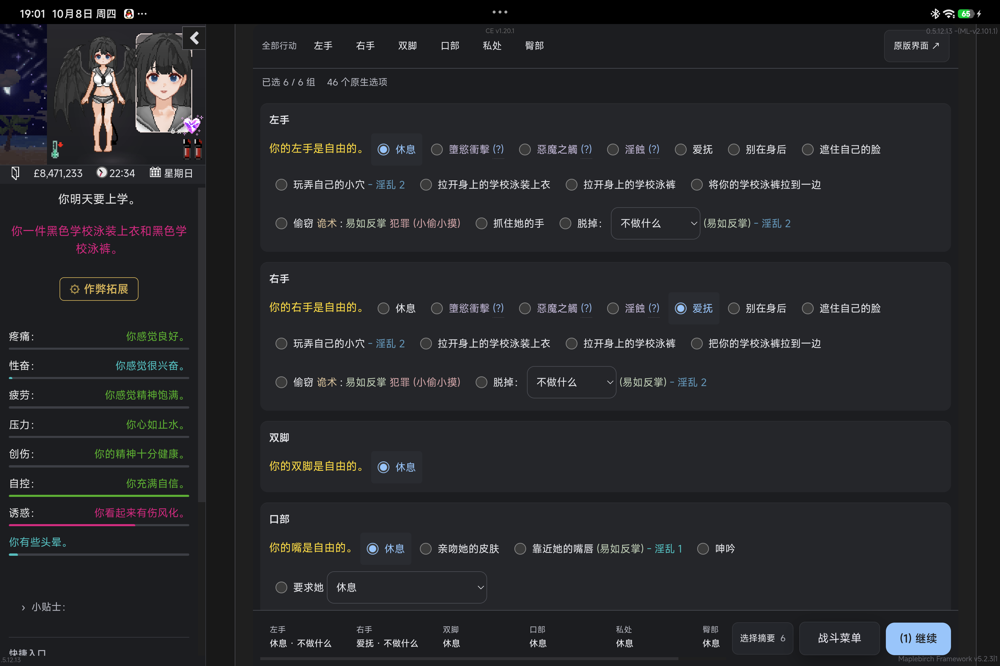
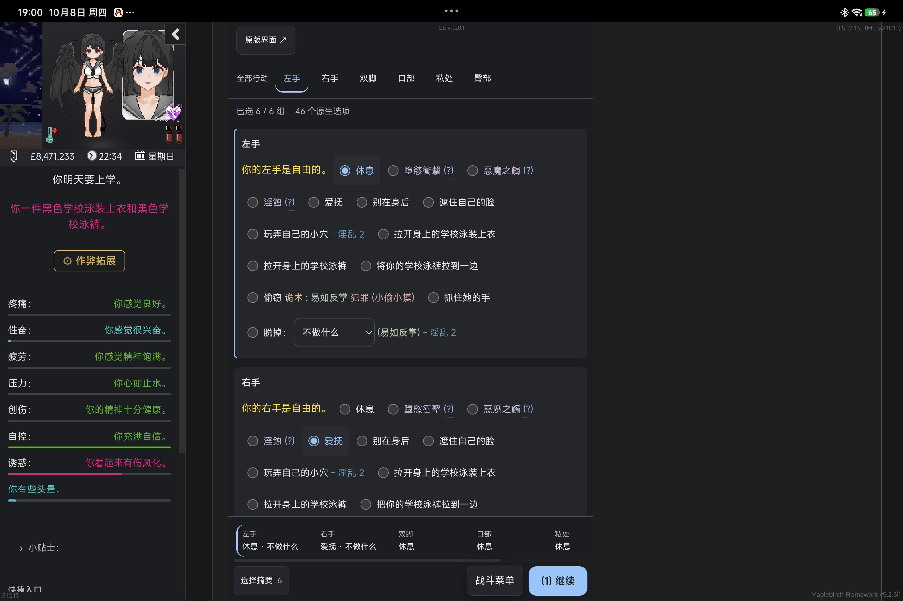
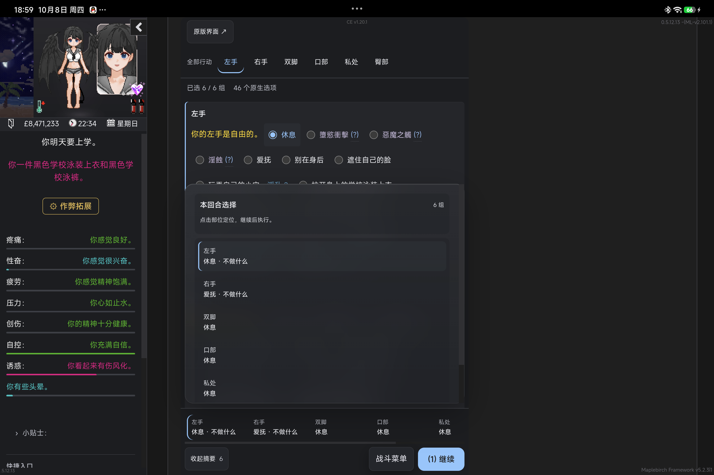

# Soft & Wet 3.0 — M4-A 战斗候选

日期：2026-10-08。分支：`prototype/soft-wet-3-m4a`，基于 M3 `9ba9c8d`。源码、测试和报告在同一候选提交中。正式 2.2.2、Release、tag、生产仓库未修改；没有启动 M4-B。

## A. 交付与所有权

本轮 Done：交付战斗领域来源、容器/内容/选择自适应候选，验证原控件、动态失效、未知内容、可恢复生命周期和代表性成本；保留 M2/M3、API v1 和原业务。真机不执行回合，原动作选择与多回合入口使用隔离浏览器补充验证，不把夹具回合当作完整 DoL 结算。

| 文件 | 改动与职责 |
| --- | --- |
| `src/combat/source.ts` | 局部来源读取原 radio/select、选中项、可见/禁用状态；输出名称、数量和显示状态。私有绑定验证当前页面、连接、父节点、name/value 和即时可用性。同步防重入只持续到 microtask，不锁住后续原回合。 |
| `src/combat/main.ts` | 使用来源投影，保留原节点岛和可恢复锚点。原操作 capture 护栏；过滤退出中的旧 Passage；动态控件更新按既有局部 Observer + RAF 合并；新页面允许从 UI 故障恢复。 |
| `src/combat/CombatPanel.vue`、`types.ts` | Vue 只拥有导航、选择摘要、工具外壳和紧凑状态提示，不拥有原业务值或原控件。提示已选组数、原生选项数量、暂不可用和保留扩展内容。 |
| `src/combat/style.css` | 实际容器不足 700px 时重排导航和固定操作栏，触控控件不缩小；900px 起少量选项可并列，超过 8 个可用选项的密集组占整行，避免把多动作压进窄卡片。临近密集组的孤立小组占整行。 |
| `tests/combat-m4a.cjs` | 重复原选择、失效/隐藏/禁用、未知 checkbox/button、550px 容器、稀疏并列、原夹具回合、故障后新页面恢复、清理与同步防重入。 |
| `tests/acceptance.cjs` | 将“菜单必须在继续按钮左边”的旧单行假设改为真正的二维遮挡检查；按钮可在不同的行。 |

**保留的稳定实现**：多原生行动区留在各自叙事位置；原 radio/select/菜单/继续链接和 handler；原分组导航与选择摘要；菜单/摘要互斥；固定操作栏及底部占位；已有 scoped Observer、ResizeObserver/RAF、destroy 和回退。没有复制商店一次性购买锁，没有泛化 Action Schema，没有新的全局轮询或状态镜像。

**业务边界**：Vue 不持有 `State.variables`，不计算伤害、概率、条件或结算。原动作依然在同一原控件上执行。本轮增加的是可见性/新鲜度护栏，不是新的业务执行器；未知按钮与 checkbox 不转换、不代理业务。

**公共边界**：`window.DoLGameUI.ui` API v1、显示偏好、Runtime、Inspector、Adapter、存档格式和 ModLoader 契约不变。未增加公开战斗 API。候选 bundle 仍沿用正式版本标识 2.2.2，`.dcu-candidate` 标记候选；不冒充新正式版本。

构建 SHA256：JS `04b9ec222b3794de49425a40c73f64dc1695e0a1875c615adb0f642e5a17cf77`；CSS `8de06cb5b271c21086edeb23311cd660b56bff97a7838df9343ae5f1393a4e79`。

## B. 玩家体验对照

| 项目 | 正式 2.2.2 | M4-A |
| --- | --- | --- |
| 动作布局 | 逐组整行，主要以 viewport 断点控制 | 真实容器决定窄布局；小组可并列，密集组保留完整宽度 |
| 当前选择 | 底部选择摘要 | 保留摘要，增加组数与可用选项提示；不可用状态明确 |
| 触控 | 固定操作栏 | 窄容器摘要轨道另起一行，菜单/继续位置与实际 hitbox 一致 |
| 动态变化 | 局部 DOM 更新 | 选择仍从原控件读取；过期、隐藏、禁用控件拒绝，不自动重放 |
| 未知内容 | 原生控件与区域 | 继续保留原节点；未识别扩展有提示，不猜业务类别 |
| 步骤 | 直接选择原动作，继续执行 | 没有新增确认步骤；导航只定位，连续选择仍合法 |

以下均为 **真实平板、同一原游戏场景**。550px 图片是在宽屏 WebView 中约束候选容器，证明容器决策，不冒充手机实测。

正式 2.2.2：

M4-A 宽容器：

M4-A 550px 容器与摘要：

## C. 验证与限制

### Delivered

- 完整 M4-A 实验候选及专项测试；M3 基线、M2/M3 源码保留。
- 上述源码/截图/报告及精简 `M4A_EVIDENCE.json`。原始设备与 Journey 记录留在本机 `tests/artifacts/m4a-20261008`，不上传完整游戏 State、凭证或 Gameplay Ledger。
- 平板暂载候选完成检查后，已恢复正式 2.2.2。没有永久安装候选、发布 Release、执行回合或读写存档。

### Validated

- `npm run build`：字段、Vue/TS/Adapter/early 类型检查及构建通过。
- `node tests/combat-m4a.cjs`：重复选择原动作，原 `V.leftaction` 与摘要一致；过期 value、隐藏与 aria-disabled 拒绝；未知原 checkbox/button 可用；550px 和稀疏并列；两次原 SugarCube 夹具继续 handler；故障后新页面恢复；销毁清理；同步重入拒绝、microtask 后合法再用。
- `node tests/acceptance.cjs`：原 `generateCombatAction` 生成控件、原选择事件、动态重建/select、未知动作、原节点、回退、5 个 viewport、清理通过。
- `node tests/combat-resize.test.cjs`：原菜单事件与节点/父级身份、状态不变、视觉档位、放大显示、固定操作栏/占位/销毁通过。
- `node tests/native-action-panel.cjs`、`node tests/multi-region.test.cjs`：无标准 list 的原动作分组、原 markup 恢复、多区域和重复 ID、叙事位置、动态替换、原事件/身份、手机/平板布局通过。
- `node tests/resilience.cjs`：局部 startup/update/Vue 故障、缺失高级能力/锚点、未知原内容、原回退通过。
- `node tests/master-toggle.cjs`：总开关、偏好、排队卸载、原节点/事件、原版回退通过。
- `node tests/wardrobe-m2.cjs`：隔离原 DoL 0.5.11.9 / Edge；原一击穿戴、550px、原预览/未知内容、源失败、六次挂载与 preview Observer 清理、原父子/兄弟/handler 恢复通过。
- `node tests/shop-source.test.cjs`：原报价/定义/页面新鲜度、一次派发边界、未知 footer 通过。M3 原购买/颜色/试穿、存储导出/导入及衣柜修理/整理的有效证据复用；这些模块本轮未改，不重跑完整商店/存档回归。
- Paisley Park Skill/CLI **3.0.2**，显式平板 `0509B830099C3540` / M367FC / Android 17 / 独立测试 App `com.vrelnir.dol.lyra.uicompat051213` / DoL **0.5.12.13** / API **1**。当前 WebView Provider 版本未重新采集，不能将历史记录当本轮验证。
- 真实 `Beach Party Sex` 页面：6 组、35 个原 radio，包含原 select 的 46 个原生选项；962px 与 550px 容器无横向溢出，550px 的摘要、菜单、继续控件中心 hit test 均命中自身，约 44px 高；原继续节点仅 1 个。
- 真机 Journey 点击已经选中的原动作、打开摘要、打开/关闭原战斗菜单、原版回退/重新启用。完整原游戏变量在暂载前后相同；没有执行回合，不能据此声称真实战斗结算通过。
- 候选卸载后原 list/menu/next 的节点身份、父节点、前后兄弟恢复；原游戏 State、Passage、偏好不变，API 1 与正式 UI 恢复。共享 Gameplay Store/Ledger 未修改。

### 代表性成本

同一真机场景，正式版与候选各 5 批 × 40 次 `DoLCombatUI.refresh()`，批次之间等待 RAF：

| 指标 | 正式 2.2.2 | M4-A |
| --- | ---: | ---: |
| 平均单次同步刷新 | 0.938ms | 1.119ms |
| 中位数批次单次刷新 | 0.850ms | 1.053ms |
| UI root 后代节点数 | 240 | 243 |

增加约 0.18ms/次（约 19%）与 3 个节点，主要伴随原控件新鲜度、可用性和显示投影检查。此证据支持当前局部成本可接受；不是 FPS、功耗、长战斗或全页面性能结论。没有据此新建缓存框架或运行 Perfetto。

### 实际失败记录

1. 旧验收将菜单右边界与继续按钮左边界比较，手机失败；实际矩形分别位于不同的行，没有重叠。改为二维交集检查后通过，没有为刷绿掩盖真实遮挡。
2. 新测试最初查找不存在的“休息”，夹具原选项实际名为“等待”。修正测试来源后通过，归属测试编写，不是工具或原业务问题。
3. 首次 Journey 使用含空格的 name，CLI 在开始执行前拒绝。已核对工具 schema：name 必须为 1–64 位字母/数字/点/下划线/连字符；改为合法 slug 后完成。不是 UI 点击失败，不修改 Paisley Park。

### Not validated

- 真机改选不同战斗动作、执行下一回合、伤害/概率/胜负和完整战斗结算；本輪按约定不点击继续。隔离测试的 `V.turn` 只是原夹具 handler 的计数，不是原 DoL 战斗结果。
- 实际手机、其它 WebView/设备、全部战斗种类与所有第三方战斗 Mod；未知控件验证是代表性扩展夹具，不是全生态证明。
- 长时间连续战斗、后台恢复、帧率/功耗，以及更低能力浏览器的容器查询专项。缺失 CSS 能力不会让原控件被删除，但未逐 Provider 验收。

### Known limitations

- 这是显示来源与原事件护栏，不是事务系统。第三方直接改变量或调用自己 handler、jQuery 合成事件，不保证经过原生 DOM capture；本轮不拦截第三方执行器。
- 防重入只阻止同步嵌套派发，不替原游戏决定异步按钮禁用或回合执行完成，不记录持久 Effect。
- 外部仅写 `.checked`/`.value` 而不发事件、不改 DOM 时，下一次现有刷新才能反映；没有为此增加轮询。
- 原列表/工具仍有既有 reversible move：区域内部原控件与 handler 保留，但依赖精确外层父级的 Mod 不能保证兼容；不宣称 DOM 零变化。
- 量化“选项”来自原控件可见/disabled 状态，不能解释为业务允许的动作数量或回合已经可执行。

## D. 后续判断

1. **达到完整候选标准：是，代表性范围已完成。** 代码、专项测试、真实平板布局/原控件/回退闭环成立；上述覆盖边界不改写为全面结算验收。
2. **三维自适应有收益：有。** 相同宽 viewport 的 550px root 会重排操作栏；小组并列、密集组整行；原选中/不可用状态决定摘要提示，不决定业务规则。
3. **原动作所有权可靠：代表性验证通过。** 仍为同一原节点和 handler；动态重建、失效拒绝、连续选择、后续原夹具回合与无重放恢复通过。超出捕获范围的第三方执行器不承诺。
4. **来源/呈现耦合降低：是。** 读取/验证在局部 source，Vue 只读有限显示投影；没有把游戏对象搬进 Vue store。
5. **保留：** 容器决策、密度分组、原控件岛、选择提示、短防重入、下一页面故障恢复。**撤回/不引入：** 旧单行布局假设、购买式一次性动作锁、万能 Action Schema、第二战斗状态机和更多常驻操作步骤。
6. **M2/M3 保持：是。** 本轮未改衣柜/商店源码；M2 代表性集成和 M3 来源专项通过，其余相关原业务证据明确复用，浏览模式没有恢复。
7. **可共享的规范：** 原节点所有权、有限显示投影、实际容器宽度、隐藏/禁用语义、未知内容原入口、局部故障恢复与 Observer 清理。战斗重复动作规则不泛化为全域购买 guard。
8. **可以进入 M4-B 规划：可以。** 不需要以遍历全部战斗为前置；本轮未自动启动，也不是 3.0 正式发布验收完成。
9. **M4-B 最小范围：** 存档列表/详情的来源与呈现分离，保留原保存/读取/删除 handler，原槽位/页面有效期检查，容器与选择驱动布局、未知扩展和原版回退；不迁移存档数据、不重写事务、云业务或第三方保存逻辑。预计 1–2 轮集中实施 + 一轮专项验收，若发现第三方槽位结构冲突再重新界定范围；不是固定工期承诺。

结论：**M4-A Completed，验证覆盖有限；没有本轮范围内的阻塞缺陷。**
