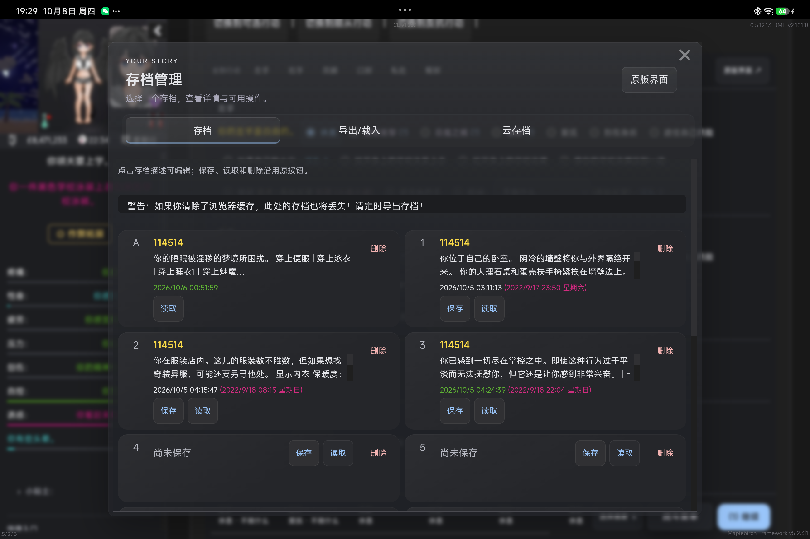
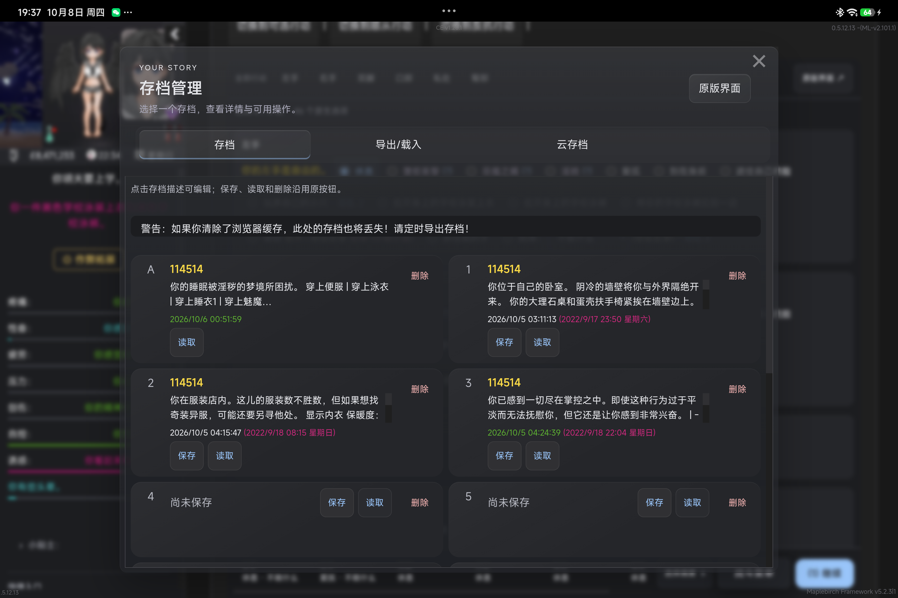
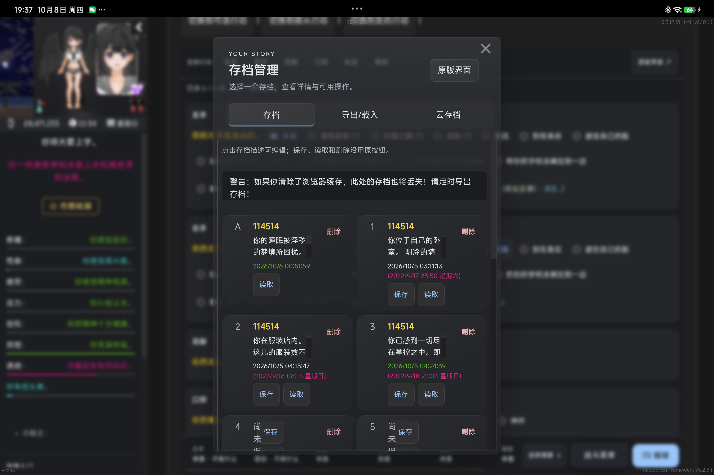
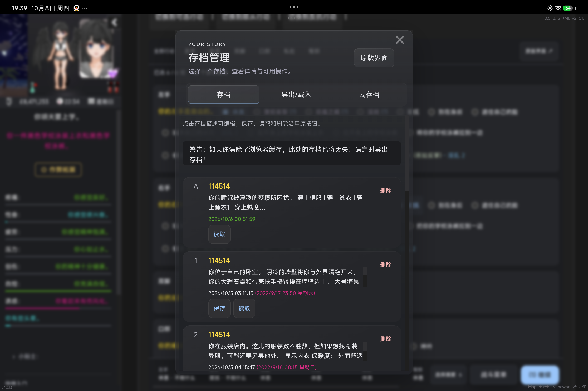

# Soft & Wet 3.0 — M4-B 存档候选

日期：2026-10-08。分支：`prototype/soft-wet-3-m4b`，基于 M4-A `848494a`。本报告与源码、测试同一候选提交；提交号见 Git 与交付消息。生产 2.2.2、Release、tag 未修改，没有启动 M5。

本轮 Done：存档来源与呈现分离，原操作新鲜度校验与不重放边界成立，保留成熟布局、第三方原节点与回退；完成隔离原版业务测试及真实 Android 只读候选检查，独立研究 gameTime。不是存档引擎、云端业务或全生态验收。

## A. 代码与所有权

| 文件 | 职责与改动 |
| --- | --- |
| `src/saves/source.ts` | 识别已审查的原槽位行，生成有限显示投影；原行、按钮、父级、handler、标记及内容构成私有绑定。重建后 key 不复用，重复槽号与未知结构留在原界面；原 `[hidden]` 内容不投影。缺日期不等于空槽，必须同时缺名称/摘要且原 Load 禁用。 |
| `src/saves/main.ts` | 组合 source、既有 metadata、transfer 与 Vue。操作前核对当前唯一列表、页面、可见性与生命周期；异步核对后再次验证绑定。关闭/刷新使旧绑定失效，挂载失败恢复原节点，新原页面可以重新挂载。 |
| `src/saves/metadata.ts` | 保留原写入 hook、名称备注键及身份格式。新增原详情只读复核：IDB `getSaveDetails()` 或 legacy `dolSaveDetails`。封存槽号与详情快照；DOM 空槽与存储占用不一致时不授权代理操作。详情源缺失/读取失败时拒绝代理，保留原版入口。 |
| `src/saves/SavePanel.vue` | 只管理搜索、选择、详情、核对中状态和消息。原列表刷新后保留搜索与选中槽号；动作在核对期间不可重复点击，只读选择没有事务锁。未知附加行提示保留位置。缺日期的已有槽显示“未记录”。 |
| `compat/dol-optimization-soft-wet/dol-optimization-soft-wet.css` | 为已命中结构增加实际容器断点，窄存档区域采用单列。只改 CSS，不搬节点、不改对方 handler；版本范围、指纹和注册 API 未改。 |
| 定向测试 | 新增 `tests/saves-source-m4b.cjs` 的 20 项断言；扩展 header 生命周期、窄容器与优化 Adapter 测试；修正过时云存档夹具，使其真正使用现有 API v1 与加载器版本工具。 |

保留：默认宽屏双列、单列窄屏、原生 modal Drawer、可选 V2 左列表/右详情、搜索、原分页、最近保存、自动/手动分组、原版确认、名称备注、原导入/导出及可恢复工具锚点。已有 V2 由实际 host 宽度 760px 决定 inline；列表 650px 容器断点足够，无需新的布局引擎或大幅改视觉。

原节点岛由游戏或第三方拥有；Vue 仅拥有代理卡片、Drawer、搜索与显示提示。按钮仍调用原节点 `.click()`，不直接调用保存引擎、不写游戏变量、不重算保存/读取条件。UI 的本地名称备注仍写 localStorage，不随存档导出迁移。

保护针对存档：先读取原详情，随后重新核对原行/原按钮，再派发原事件；同一原行同一内容尚无明确刷新时，临时 WeakMap 阻止重复代理操作。该标记在 Vue 重挂载时保留，原行/内容变化后由新投影重新判断。不是持久事务记录，不推断业务成功，不自动重试，不复制商店一次购买锁或战斗 microtask guard。

`transfer.ts` 和既有工具移动保持原方案：已知工具有锚点可还原，未知/云布局不强行重排。没有声称 DOM 零变化。新增 source 没有全局扫描器，继续使用既有 Observer + RAF 合并；普通选择/搜索/滚动只使用投影。存储复核只发生在真实代理动作前，不为浏览每次读取完整存档。

**API 与存档写入：** API v1、公开声明、Runtime 与偏好键没有变化。本轮未新增或改变存档写入行为；既有 `metadata.dolGameUI.gameTime` 写入继续存在，不能将其表述成“UI 完全不写 metadata”。候选 bundle 沿用 2.2.2 标识，以 `.dgs-candidate` 区分临时候选，不是正式新版本。

构建哈希与现场摘要见 [M4B_EVIDENCE.json](M4B_EVIDENCE.json)。代码候选没有自动发布、安装正式包或覆盖生产工作区。

## B. 玩家体验对照

| 场景 | 正式 2.2.2 | M4-B |
| --- | --- | --- |
| 普通槽位列表与详情 | 已成熟的双列/Drawer、可选 V2 | 保留相同组织，避免为版本规模重做 |
| 原列表刷新 | 搜索与选择随组件重建重置 | 搜索与选中槽号保留；操作绑定重新生成 |
| 缺日期但原 Load 可用 | 可能被当作空槽 | 保留为已有槽，不从缺字段猜保存状态 |
| 自动槽 | 保留独立槽与原 Load/Delete | 不将自动槽第一个 Load 当作 Save；空自动槽详情仍标为自动存档 |
| 危险操作 | 原按钮代理及原确认 | 原确认保留，补当前槽/原按钮/原详情核对；拒绝陈旧目标与不明结果的重复代理 |
| 未知第三方行 | 留在原容器 | 继续保留，补可见位置提示；不转换未知业务 |
| 原版优化存档 | 描述编辑、日期与原按钮保留 | 继续 style-only；实际窄容器单列，解决宽 viewport 下拥挤双列 |
| 回退 | 原版入口与工具恢复 | 保留，并验证失败后下一原页面可恢复；UI 恢复不冒充业务完成 |

真实平板：原版优化在宽区域的展示基本不变。

实际容器缩到约 522px，原规则仍两列；本轮轻量 CSS 修正为单列。保持全部原节点、原描述和操作。

## C. gameTime 专项结论

### 必须核对的事实

1. **何时写入：** 存档 UI 启用时注册 SugarCube `Save.onSave` hook，原保存链运行时写入；不要求存档列表处于打开状态。局部/总关闭、destroy 会移除自己的 hook。不是每次打开列表写入。
2. **写什么：** 从当前 `Time.year/month/monthDay/hour/minute` 获取五个有限数字，格式化为 `YYYY/M/D HH:mm`。只增加显示 metadata，不写 state/history；读取原详情时取这个短字符串。
3. **可见用途：** 普通卡片日期旁和详情“游戏内时间”。真实保存时间仍来自原 `date`；local 名称备注另有键，不依赖 gameTime。
4. **原版等价信息：** 所查 0.5.11.9 源码与实际 0.5.12.13 原详情没有等价的每槽游戏时钟 metadata。`date` 是现实保存时间，`playTime/loadTime` 不是游戏内日期，localStorage 的 `time` 也不是每槽快照。真实 0.5.12.13 保存 payload 有 `delta`，可见 `startDate/timeStamp`，且提供 `DateTime`；原版优化也读取 payload 推导日期。这是潜在替代来源，**不是现成的薄详情字段**。
5. **停止写入的退化：** 新保存不再产生该快照，列表/详情游戏内时间可能变为“未记录”；旧字段仍可读，重新覆盖旧槽后不能拿旧时钟冒充新进度。
6. **现有依赖：** 项目内已确认读取者是存档呈现，测试也验证该字段。本轮实际槽中存在旧字段。原版优化使用原 payload 时间，没有发现它依赖该字段；未审查所有第三方，外部依赖结论为 **unknown**，不能保证没人读。
7. **真实兼容风险：** 隔离原版无 UI 的 IDB/legacy 读档与 serialized 导入均通过，未见该字段阻塞原读档。代码会整体赋值 `metadata.dolGameUI={gameTime:...}`，因此可覆盖同 namespace 的其他字段；这是明确代码边界，**没有本轮第三方冲突实例**。当前存档原格式/引擎没有被替换，但附加 metadata 仍是写入例外。
8. **无需写存档的替代：** 按需读取原 payload，依据真实保存格式/当前 index 正确恢复时间，再只用于显示。可行性有来源证据，尚未实现或证明所有压缩、legacy、历史 delta、第三方格式的等价读取。逐槽取完整保存会增加 I/O/解码成本，不能为了纯净架构默认让列表加载每个完整存档。

### 独立产品建议：八个回答

1. **为何存在？** 让 UI 用原薄详情快速显示保存当时的游戏时钟，不需读完整存档。
2. **如何写读？** 自己的 onSave hook 写，原存档引擎持久化，列表通过原详情读；当前写读行为未改。
3. **用户得到什么？** 可在读档前区分游戏内哪一天、哪一时刻保存，不只看到电脑/手机保存日期。
4. **能否原字段替代？** 薄详情没有等价字段；保存 payload 有可研究替代，不能直接拿现实日期替换。
5. **应否继续写？** 本候选继续写。已有价值且兼容测试通过，本轮没有足够理由直接停写。
6. **停写代价？** 新槽/覆盖槽时钟显示退化，或需新增按需完整存档读取，另有格式与性能验证成本。
7. **推荐方案？** 3.0 首先明确记录这是 UI 附加 metadata；保留当前快照及历史读取，不迁移。若希望零 UI metadata 写入，再单独批准一个仅按需详情取原时钟的有限实验，先证明等价与成本，再决定新保存是否停写。无需新 Save Runtime。
8. **额外授权是什么？** 停止/改变正式 onSave 写入、合并 namespace 改变写入语义、删除显示、改兼容承诺或迁移历史字段，都应由用户决定。本轮没有做这些改变，也没有修改已有真实存档。

## D. 验证、证据与限制

### Delivered

- 已完成来源、原按钮有效期、原详情复核、未知内容、搜索/选择保持、失败后新页面恢复与窄容器修正。
- gameTime 研究与八项建议已交付，写入保留。
- M2/M3/M4-A 与 API v1 源码未改，原版优化只补 CSS；MapleBirch 没有产品代码改动。

### Validated

- `npm run build`：Vue/TS、Adapter/early 类型检查、构建通过。
- `saves-source-m4b.cjs`：20 项针对性断言，包括旧 key、存储变动、异步关闭、handler/父级/槽号变化、隐藏、占用冲突、重复操作、重复槽号、未知扩展、metadata 缺失与原写入。
- `saves-runtime.cjs`：真实原版 0.5.11.9 隔离浏览器，实际 IDB 保存、覆盖、读取与删除，原确认与取消，legacy、分页、反馈、V2/默认 Drawer、宽窄/200% 字体及回退。
- `save-compatibility.cjs`：隔离保存导出后，重新打开没有 UI 的原版，原生读 IDB/legacy 与导入 serialized 保存通过。这才是业务结果证据，不以 click 成功替代。
- `saves-header-lifecycle.cjs`：原 Tab/按钮身份、原节点恢复、450px 容器/1363px viewport、200% 字体、查询保持、故障与下一原页面恢复。
- `saves-native-tools.cjs`：原文件/textarea/按钮事件、精确顺序恢复；MapleBirch API v1 style-only、动态 option、关闭/撤销、390/1024/1363px/200%、能力档位。使用本地 handler，无云请求。
- `optimization-adapter.cjs`：使用原版优化 1.1.1.2 实际 `opt-main.js` 的描述编辑方法，在假存档上检查确认/取消、原事件/节点/父级/顺序、日期、隐藏/未知、版本/指纹降级和窄容器。没有扩大发布兼容声明。
- `resilience.cjs` / `master-toggle.cjs`：局部故障、原版回退、未知内容、总开关和偏好保持通过；后续存档字段保护由上述定向用例覆盖，不再扩大整项目测试。
- **真实 Android**：M367FC / Android17 / 独立 `com.vrelnir.dol.lyra.uicompat051213` / DoL0.5.12.13。Paisley Park3.0.2 Journey 打开原菜单，Capture/CDP 观察；临时注入当前候选，确认 12 原行、32 原控件、8 已知投影、原版优化 full match。约 972px 内容宽区与 522px 窄区检查通过，后者原控件单列且无横向溢出。
- 撤销候选恢复正式2.2.2；48 个原节点的连接、父级、前后兄弟、onclick 和 value 全部一致，原 State、Passage、存档详情与显示偏好一致。没有执行用户存档保存、读取、覆盖、删除或导入。
- M2/M3/M4-A 的既有有效证据复用，且 `git diff 848494a -- src/wardrobe src/shop src/combat src/runtime src/public` 无改动；没有恢复衣柜浏览实验。

**性能证据：** 同一真机页面，5×40 次普通 refresh 的均值正式约0.9515ms、候选约0.9970ms；UI 子节点157→158，原行/控件数量不变。这是 fast path 的同步成本，不是完整挂载、FPS 或整游戏速度。隔离长摘要投影：10 槽均值约0.060→0.100ms，100 槽约0.524→0.946ms；校验有新增成本，但代表性绝对成本有限，没有为此增加缓存/镜像。普通详情选择和滚动不会重新扫描 source，继续复用原分页控制规模。

**保留的失败：** 第一次菜单 Journey selector 匹配3个节点，失败后观察确认未打开存档，改为现场唯一选择器；未重放未知存档操作。云样式夹具原来依赖已删除 `.mbsw-*` 标记且没有真实 API/semver/rescan，修正夹具后通过，没有改云逻辑。容器 CSS 第一次放在基础 grid 规则前被覆盖，测试失败；移到规则后，测试及真机重新核对单列。原始记录留在 `tests/artifacts/m4b-20261008/`，没有删失败或更换 Gameplay Store。

### Not validated

- 真机破坏性保存/读取/删除/覆盖/导入，以及文件导出调起系统能力；本轮未获指定真实槽位授权，以隔离原版业务验证补足。
- 真实云认证、同步、读写或所有第三方版本；MapleBirch 是已知结构夹具覆盖，原版优化是真机已加载结构与受审原方法覆盖。
- 其它设备/WebView、所有游戏版本、全部 Mod 组合及未来 payload 时钟替代。

真机撤销后仅补充一项文案：已有槽缺摘要时显示“此存档未提供摘要”，避免误写成空槽。该末尾文案通过构建和 header 定向验证，未重新部署真机；现场 bundle 与最终 bundle 哈希分别保留在证据中。

以上为 Additional coverage，不是本轮未实现事项。

### Known limitations

- 原详情检查与随后原 click 不是跨原引擎的原子事务，仍存在外部脚本在最后核对后改变槽位的竞态；不通过另造事务引擎承诺消除它。
- 护栏覆盖 Soft & Wet 代理入口；第三方和原节点直点仍由原业务负责。优化包明确保留原按钮，不把它们伪装成受 UI 代理事务保护。
- 原结果未知且原行没有刷新时，代理不会再次执行同一绑定；用户可重新打开存档页或回退原版核对。完整 Runtime 销毁后不保留 Effect 数据，不自动重放。
- 详情读取缺失/结构不识别时代理拒绝操作，原界面可用。未知信息保留原位置，不保证任意第三方都会变成 V2 详情。
- 已有工具/transfer 移动有恢复锚点，但极度依赖外层结构的旧 Mod 仍可能需要专项适配。
- 当前 gameTime 仍有 UI 附加 metadata 写入，外部读取依赖 unknown；已知namespace整体赋值的局限如 C 所述。

## E. 下一阶段：八项判断

1. **完整存档候选标准：达到，Completed / coverage limited。** 本轮承诺与代表性验收成立，发现的窄容器问题已修复，没有本轮阻塞缺陷。
2. **需要架构返工？** 没有发现需要推翻方案 D 的问题。原存档所有权可以保持，metadata 例外需要明确产品决定，不需先重写引擎。
3. **四个领域能否共维护？** 可以。共同使用现有 Runtime/主题/回退，但各自保留原操作语义：衣柜直接穿戴、商店报价/一次派发、战斗连续选择、存档详情复核与不重放；不合成万能业务模型。
4. **值得共享什么？** 容器断点、有限显示投影、原隐藏/禁用语义、节点/事件 ownership、未知 native 入口、局部失败/清理契约、最小充分证据。共享规范与已有 helper 足够，不先造统一 Action/Transaction SDK。
5. **真的需要 M5 新公共接口？** 当前没有消费者证据证明需要。四页候选解决的是自有 UI，不自动转为第三方公共 API；建议先整体收口，再由真实第三方接入缺口决定。
6. **API v1 哪些足够？** 主题/档位/能力查询、Style Adapter 注册/诊断/rescan、Modal/Drawer 请求、Inspector；既有衣柜 Slot Extension 已可服务受审类别扩展。没有需要公开存档 payload、原按钮绑定或私有 Vue store 的理由。
7. **距离3.0正式候选还缺什么？** M2、M3、M4-A、M4-B 已有候选。发布前仍须另约整体收口：确认 gameTime 产品政策、整理候选/正式包版本与安装说明、合并设计与 API/升级文档、做一次核心集中验收及发布包检查。不是重新遍历所有设备/Mod，M5 不是默认前置。
8. **工作量估算？** 建议整体收口1–2轮集中工作，实际问题才追加修复轮；不做新公开协议时 API 以文档一致性为主。若批准停写与 payload 替代，应单列实现与格式/性能专项，另估1–2轮；跨作者的新协议无当前可靠工期。不是发布日期承诺。

本轮结束于 M4-B 候选；不自动启动 M5，不更新正式 Release 或 tag。
